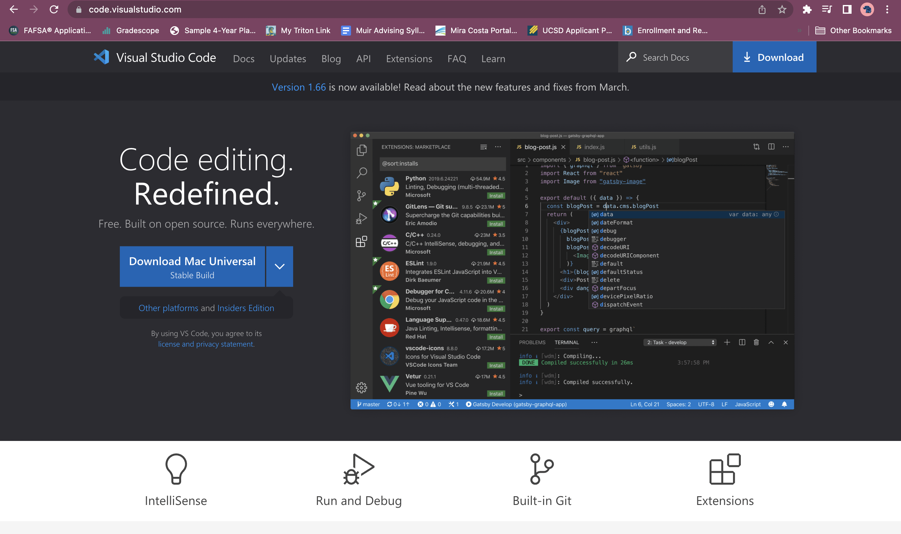
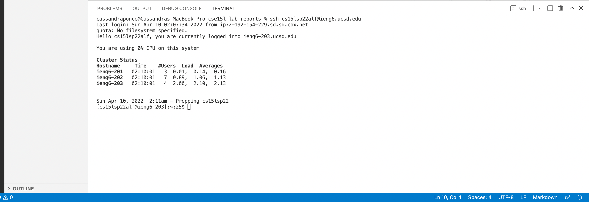
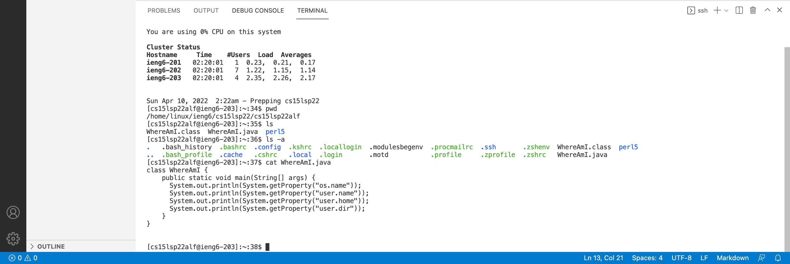
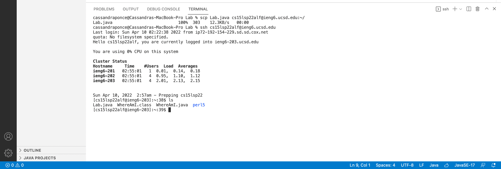
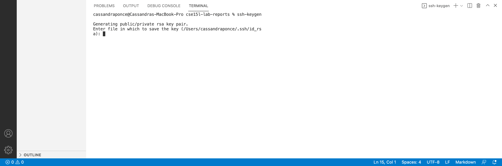
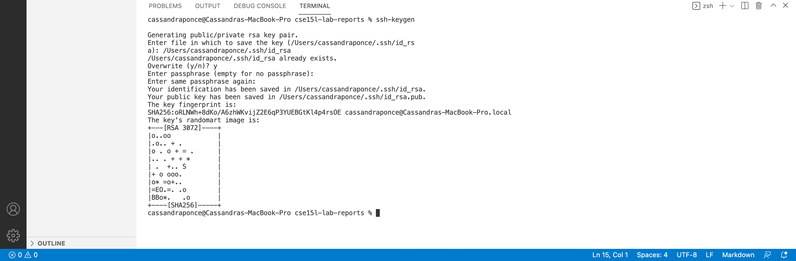
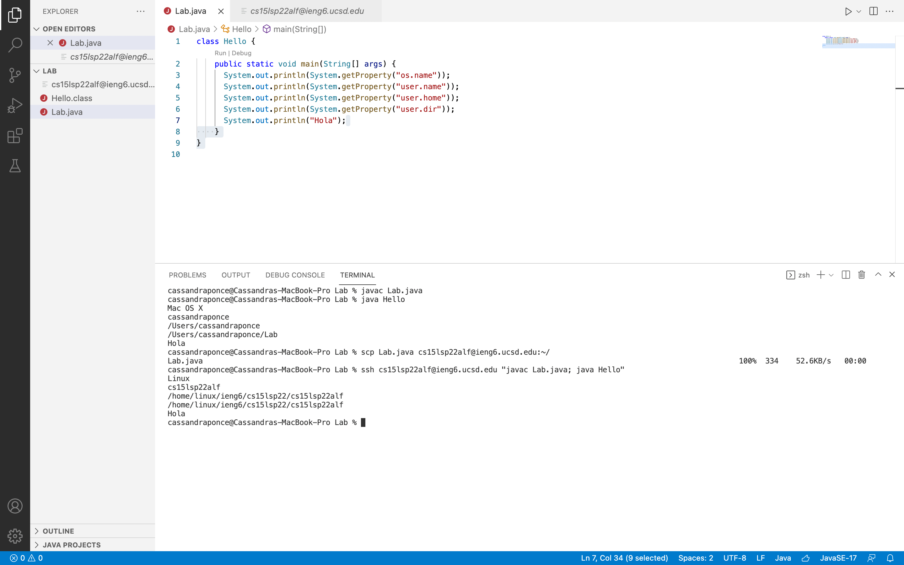

# Remote Access

## Installing VS Code
* Follow the [Link to Visual Studio Code](https://code.visualstudio.com/)
* Then click the download button to install Visual Studio Code. 

## Remotely Connecting
* On Visual Studio Code, open a new terminal by clicking on Terminal on the top menu and then click New Terminal.
* We will use the ssh protocol to remotely connect to the server by typing: ssh << username >>@ieng6.ucsd.edu   
on the newly opened terminal.
* Input your password. Once that is done you are now remotely connected to the computer. Your terminal should look similar to the screenshot provided below. 

## Trying Some Commands
* Type in pwd on the terminal. The pwd command prints the working directory on the terminal.
* Type in ls on the terminal. The ls command lists files. 
* Type in ls -a on the terminal. The ls -a command lists all the files including the hidden ones. 
* Type in cat on the terminal. The cat command can be used to display the contents of a file. 

## Moving Files with scp
* To move files from one computer to another remote computer, we can use the scp command on the client computer to help us do so. In the terminal from the directory where your desired file is in type: scp << filename >>  << username >>@ieng6.ucsd.edu:~/  
* If prompted type in your password, and to log into the  ieng6  remote server type: ssh << username >>@ieng6.ucsd.edu
* Once you are remotely connected to the ieng6 computers you should be able to see the file when you type ls on the terminal of your remote server. 

## Setting an SSH Key
* Call shh-keygen on the terminal of your client computer to create a public key file and a private key file. Your terminal should look like the screenshot below. 

* Next, you want to type the file name of the private key ending in id_rsa, then press enter.
* Then you will be prompted to “Enter passphrase (empty for no passphrase):” just press enter. You will also be prompted to “Enter same passphrase again:”, and once again you just want to press enter.Your terminal should look similar to the screenshot below. 

### Public Key to Server
* To copy the public key to the server, begin by remotely connecting to the server by typing: ssh << username >>@ieng6.ucsd.edu and enter your password
* Type mkdir .ssh and press enter. Then click control d to log out of your account on the server. 
* Once you are on your client, type: scp /Users/cassandraponce/.ssh/id_rsa.pub << username >>@ieng6.ucsd.edu:~/.ssh/authorized_keys

## Optimizing Remote Running
* Begin by creating a secure copy of the file by copying and pasting the following into the  terminal:  scp << filename>> << username >>@ieng6.ucsd.edu:~/ 
* Then we will remotely connect to the server and compile/run the file from the remote server by copying  and pasting: ssh << username >>@ieng6.ucsd.edu "javac Lab.java; java Hello"      to the terminal.
* Note: I am using quotes to run the commands directly on the server, and I am able to put multiple commands on a single line by using a semicolon.

