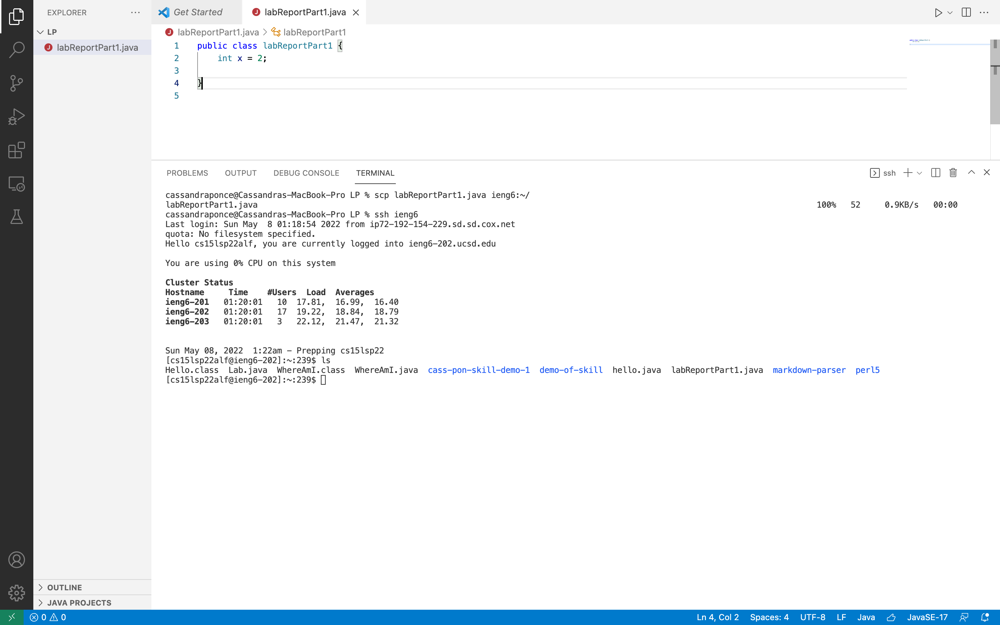
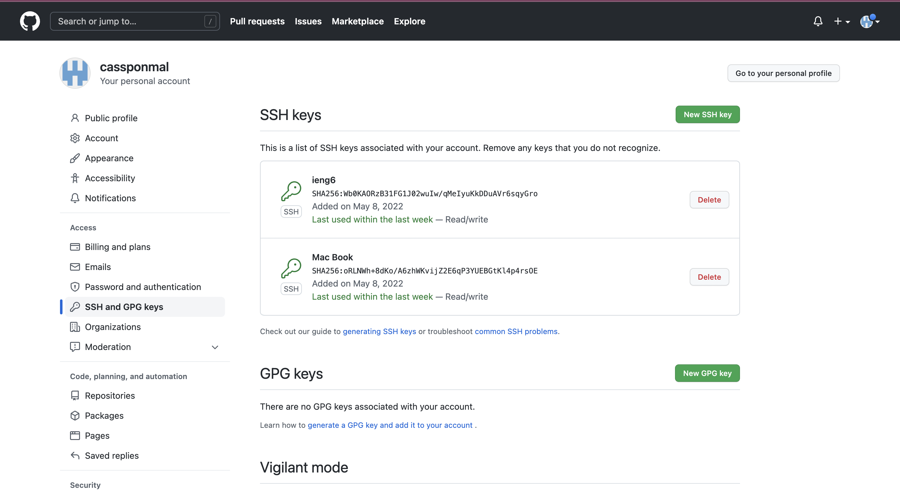
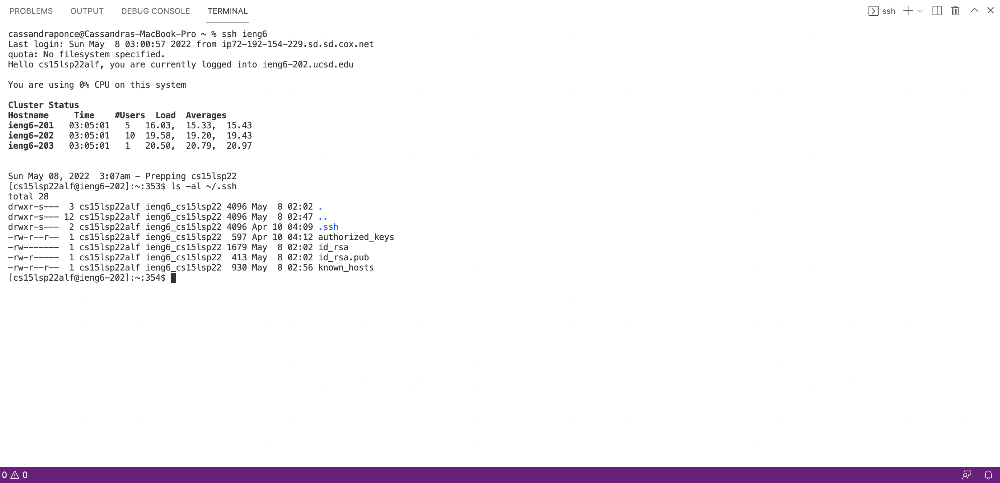
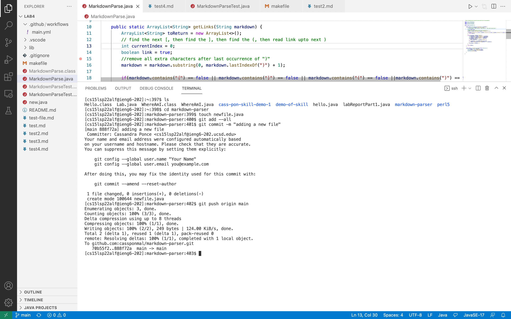
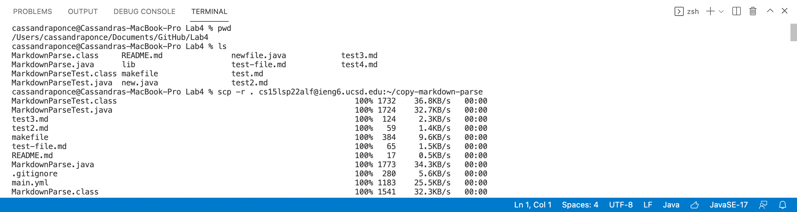
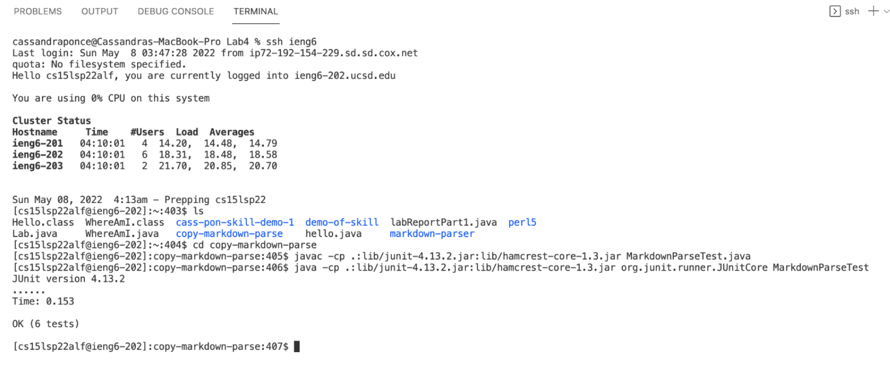
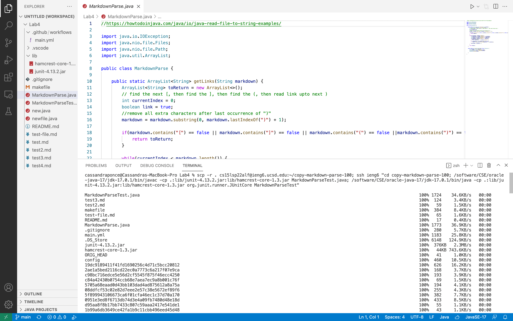
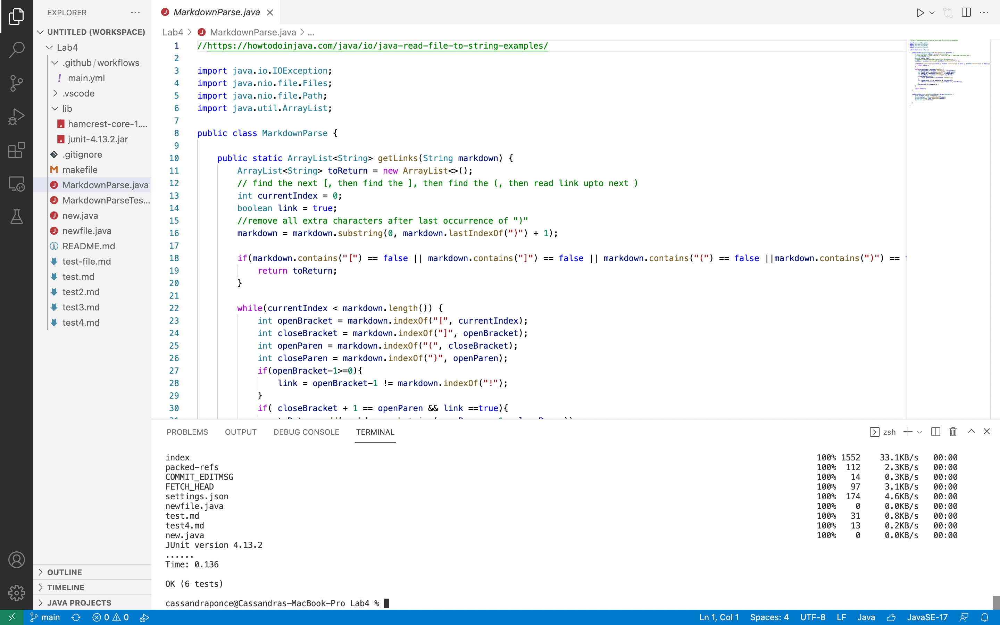

# Streamlining ssh Configuration
By streamlining the ssh configuration, you no longer have to type out  `ssh` << username >> `@ieng6.ucsd.edu`. Instead you can use ssh configuration files to be able to simply use an alias of your choice to log into a server. 

## **Editing .ssh/config**

On Visual Studio Code, I opened a new terminal and I used `vim` as the tool to edit my .ssh/config file by entering `vim ~/.ssh/config` in my terminal. 

 
 

## **Logging Into My Account Using the Alias**

On Visual Studio Code, I opened a new terminal and I used the ssh protocol and my alias to remotely connect to the ieng6 server by entering `ssh ieng6`  in my terminal. 

 
 

## **scp Command Copying a File Using The Alias**

To copy a file into my account using my alias I typed in this scp command:
`scp labReportPart1.java ieng6:~/`

 
 
 
 

# Setup Github Access from ieng6
In order to use git commit and git pull from the command line, I added my public key to Github, as you must use a token based login. Once I added my public key onto github I was able to use git push from the command. 

## **The Public Key Stored on Github**

 
 

## **Public Key and Private Key Stored in User Account**

 
 

## **Running Git Commands While Logged Into ieng6 Account**

[Link to Commit](https://github.com/cassponmal/markdown-parser/commit/888f72a99ced82ba87f928230ae4824409a8d609)

 
 
 
 

# Copy Whole Directories With scp -r

To copy entire directories from one computer to another, we can use the scp -r command option. This command allows us to recursievely copy the files and directories of a directory.

By using the scp command we can copy a directory onto a remote server, by typing "
`scp -r . << username >> @ieng6.ucsd.edu:~/<< name of copy>>`

## **Copying the markdown-parse directory To ieng6 Account**

 
 

## **Logging Into ieng6 Account and Compiling and Running Tests**

 
 

## **Combining scp, ; , and ssh to copy the Whole Directory and Run the Tests in One Line**

 
 
 
 