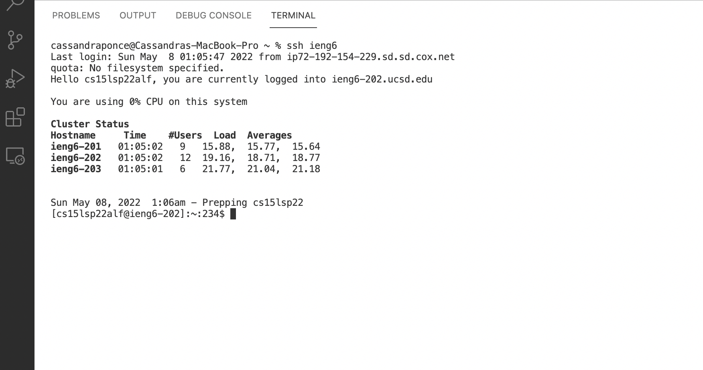

# Streamlining ssh Configuration
By streamlining the ssh configuration, you no longer have to type out  `ssh` << username >> `@ieng6.ucsd.edu`. Instead you can use ssh configuration files to be able to simply use an alias of your choice to log into a server. 

## **Editing .ssh/config**

On Visual Studio Code, I opened a new terminal and I used `vim` as the tool to edit my .ssh/config file by entering `vim ~/.ssh/config` in my terminal. 

 

## **Logging Into My Account Using the Alias**

On Visual Studio Code, I opened a new terminal and I used the ssh protocol and my alias to remotely connect to the ieng6 server by entering `ssh ieng6`  in my terminal. 

 

## **scp Command Copying a File Using The Alias**

To copy a file into my account using my alias I typed the following scp command into the terminal:
`scp labReportPart1.java ieng6:~/`

 
 
 

# Setup Github Access from ieng6
In order to use `git commit` and `git pull` from the command line, you must use a token based login so I added my public key to Github. Once I added my public key into Github I was able to use git push from the command line. In order to add my public key into Github I copied the SSH public key, I went to Settings on Github, I clicked "New SSH key" and I pasted my key.

## **The Public Key Stored on Github**

 

## **Public Key and Private Key Stored in User Account**

 

## **Running Git Commands While Logged Into ieng6 Account**

Once I added my public key into Github, I was able to connect to the remote server and commit and push the change of, adding a new file to my repository, from the command line.

[Link to Commit](https://github.com/cassponmal/markdown-parser/commit/888f72a99ced82ba87f928230ae4824409a8d609)
 
 
 

# Copy Whole Directories With scp -r

To copy entire directories from one computer to another, we can use the `scp -r` command option. This command allows us to recursively copy the files and directories of a directory. 
By using the  `scp -r` command we can copy a directory onto a remote server, by typing "
`scp -r . << username >> @ieng6.ucsd.edu:~/<< name of copy>>`

## **Copying the markdown-parse directory To ieng6 Account**

 

## **Logging Into ieng6 Account and Compiling and Running Tests**

 

## **Combining scp, ; , and ssh to copy the Whole Directory and Run the Tests in One Line**

In order to combine the scp command to copy a directory, the ssh protocol to remotely connect to the ieng6 server, and javac/ java to run the tests, on one line type:
`scp -r . cs15lsp22alf@ieng6.ucsd.edu:~/copy-markdown-parse-100; ssh ieng6 "cd copy-markdown-parse-100; /software/CSE/oracle-java-17/jdk-17.0.1/bin/javac -cp .:lib/junit-4.13.2.jar:lib/hamcrest-core-1.3.jar MarkdownParseTest.java; /software/CSE/oracle-java-17/jdk-17.0.1/bin/java -cp .:lib/junit-4.13.2.jar:lib/hamcrest-core-1.3.jar org.junit.runner.JUnitCore MarkdownParseTest"`

 
 
 