# **My Implementation of markdown-parse :**
[Link to My markdown-parse Repository](https://github.com/cassponmal/markdown-parser)
## **Snippet One**
### Snippet One Junit  Test
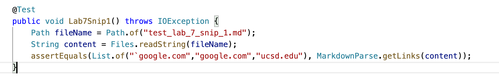
### Results of Running the Test
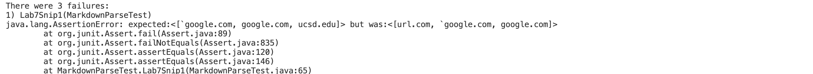
This is the corresponding output for the test of snippet 1, and the test failed. 

 
 

## **Snippet Two**
### Snippet Two Junit  Test
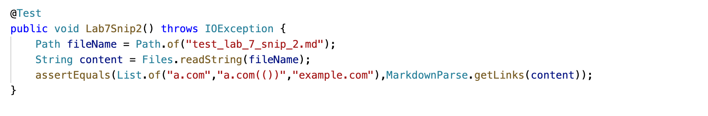
### Results of Running the Test
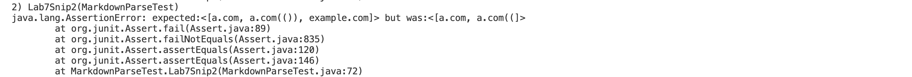
This is the corresponding output for the test of snippet 2, and the test failed. 

 
 

## **Snippet Three**
### Snippet Three Junit  Test
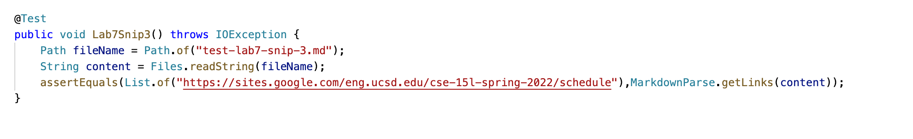
### Results of Running the Test
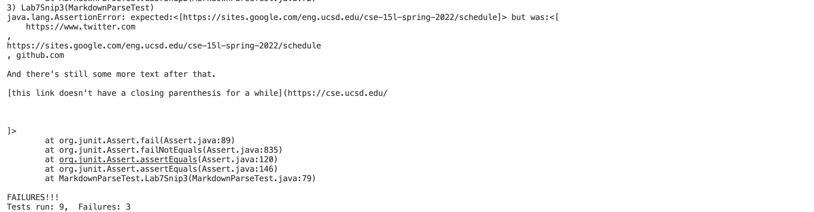
This is the corresponding output for the test of snippet 3, and the test failed. 

 
 
 
 
 

# **Implementation Reviewed In Week 7 of markdown-parse:**
[Link to Implementation of markdown-parse Reviewed In Week 7](https://github.com/alixintong/markdown-parser)
## **Snippet One**
### Snippet One Junit  Test
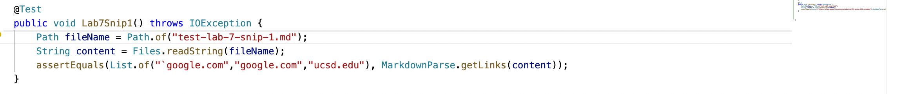
### Results of Running the Test
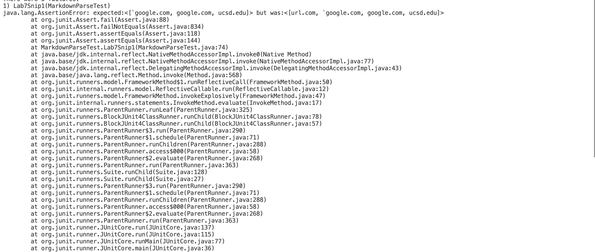
This is the corresponding output for the test of snippet 1, and the test failed. 

 
 

## **Snippet Two**
### Snippet Two Junit  Test
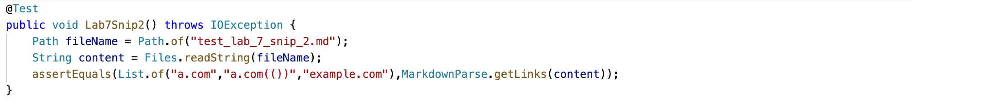
### Results of Running the Test
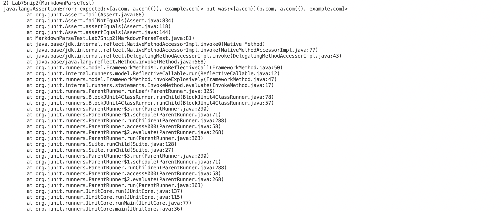
This is the corresponding output for the test of snippet 2, and the test failed. 

 
 

## **Snippet Three**
### Snippet Three Junit  Test
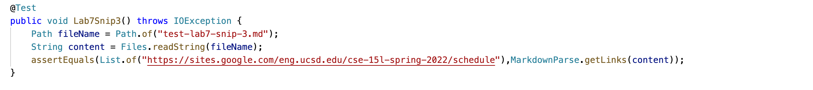
### Results of Running the Test
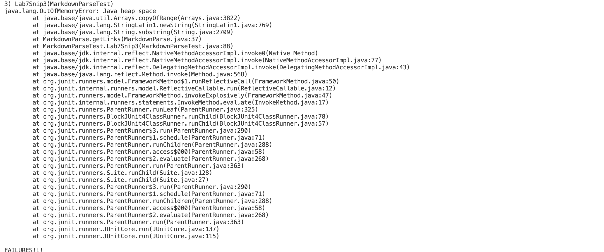
This is the corresponding output for the test of snippet 3, and the test failed. 

 
 
 
 
 

# **Questions and Answers**

* **Answer the following questions with 2-3 sentences each:
Do you think there is a small (<10 lines) code change that will make your program work for snippet 1 and all related cases that use inline code with backticks? If yes, describe the code change. If not, describe why it would be a more involved change.**   I believe that the code change needed to make the program work for cases that use inline code with backticks is more involved than just 10 lines of code. When you consider backticks, there are a lot of possible situations that you have to account for like when the backticks are in the brackets of the link format, when the backticks are in the parenthesis of the link format, when one backtick is in the bracket portion of the link format and the other backtick is in the parenthesis portion of the link. I believe that it would be helpful to have an if statement to ensure that the index of the backtick is after the index of the open bracket or that the index of the backtick is before the index of the closed bracket to help ensure the link is valid. 

* **Do you think there is a small (<10 lines) code change that will make your program work for snippet 2 and all related cases that nest parentheses, brackets, and escaped brackets? If yes, describe the code change. If not, describe why it would be a more involved change.**   I believe that the code change needed to make the program work for cases that use inline code with nest parentheses, brackets, and escaped bracket is more involved than just 10 lines of code. When you consider nested brackets, there are a lot of possible situations that you have to account for like when there are an odd number of brackets or parenthesis, when there are an even number of brackets or parenthesis, when there are parenthesis in the brackets portion of the link format, when there are brackets in the parenthesis portion of the link format, and many more cases. I believe that it would be difficult to determine the outer brackets and outer parenthesis of the link format when there are nested parentheses, brackets, and escaped brackets.

* **Do you think there is a small (<10 lines) code change that will make your program work for snippet 3 and all related cases that have newlines in brackets and parentheses? If yes, describe the code change. If not, describe why it would be a more involved change.**   I believe that the code change needed to make the program work for cases that have newlines requires a few if statements. When you consider newlines in brackets and parentheses, you are not allowed to have any newlines in the parenthesis portion of the link format and you can't have a newline in the bracket portion of the link format either. This can be addressed in a small code change in the form of an if statement.

