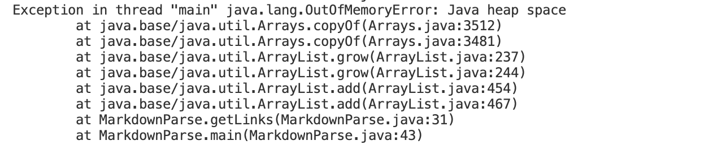
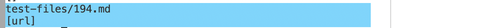
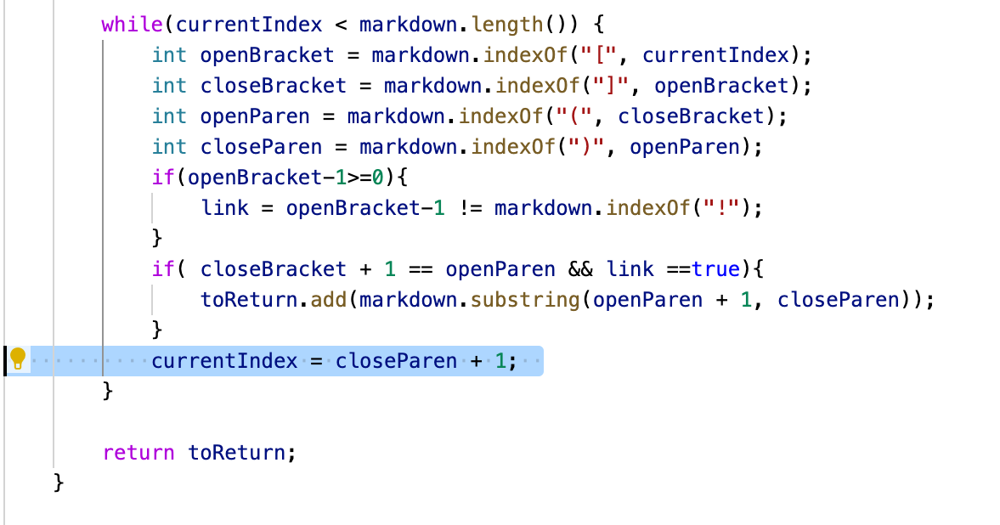
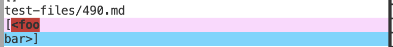
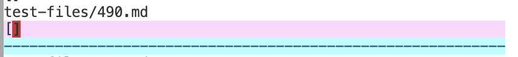
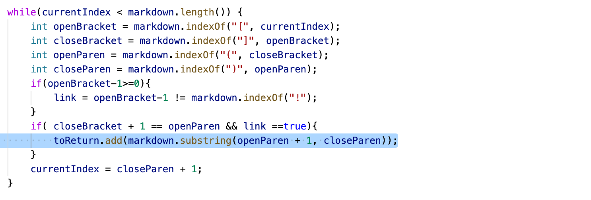

# How did you find the tests with different results?
In order to find the tests with different results, I used vimdiff on the results of running a bash for loop.
 
 
 

# First Test File With Different Results
[link to the test file](https://github.com/nidhidhamnani/markdown-parser/blob/main/test-files/194.md)
 

## Description of Correct Implementation
For the test file, 194.md, neither my implementation nor the implementation from Lab 9 produced the correct output. 
 

## My Implementation Test Output

 

## Implementation from Lab 9 Test Output

 

## Expected Output
[my_(url)]

## Description of Bug 

For my implementation of markdown-parser, the bug in the program is the logic behind calculating the index of the last parenthesis. The test file caused an infinite loop in the program, as the loop condition for the while loop is always true because the logic behind calculating the index of the last parenthesis does not account for test files with multiple sets of brackets and parentheses. In the current program , currentIndex will never exceed the length of markdown with this test file, because the program relies on the index of the closed parenthesis being after the index of the open parenthesis and brackets, which is not always the case.

 
 
 

# Second Test File With Different Results
[link to the test file](https://github.com/nidhidhamnani/markdown-parser/blob/main/test-files/490.md)
 

## Description of Correct Implementation
For the test file, 490.md, the implementation from Lab 9 produced the correct output, as it returned an empty list.  
 

## My Implementation Test Output

 

## Implementation from Lab 9 Test Output

 

## Expected Output
[]

## Description of Bug 

For my implementation of markdown-parser, the bug in the program is the logic used to determine the link. Currently the program returns anything between the index of the open parenthesis and the index of the closed parenthesis as a valid link. The program fails to account for newlines  and white space in between the parenthesis, as seen in the output of this test file.  
