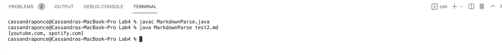
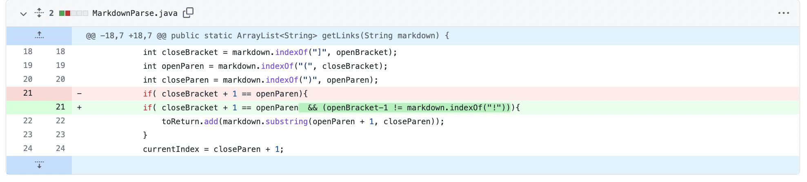
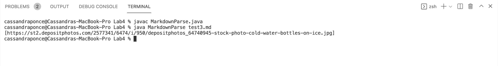

# Lab Report 2

## **Code Change One**

[Link to The Test File With The  Failure-Inducing Input](https://raw.githubusercontent.com/cassponmal/markdown-parser/main/test.md)

### Symptom of Failure-Inducing Input

### Description of the Relationship Between the Bug, the Symptom, and the Failure-Inducing Input:
As my partner and I were testing the Markdown Parser Program, we noticed that test case files that contained extra blank lines after the last link, were failure-inducing inputs, which prompted the symptom of an OutofMemory error in the output.  The bug of the program was in the while loop, which was causing the symptom of an infinite loop. The loop condition was always met when there  were extra blank lines after the index of the last Closed Parenthesis, because those extra blank lines increased the length of the markdown string, which the program was not accounting for. 
 
 
 
## **Code Change Two**

[Link to The Test File With The  Failure-Inducing Input](https://raw.githubusercontent.com/cassponmal/markdown-parser/main/test2.md)

### Symptom of Failure-Inducing Input

### Description of the Relationship Between the Bug, the Symptom, and the Failure-Inducing Input:
Another example of a failure-inducing input for the program, where files where the brackets, and  parentheses, were far apart and there was text between them.  Because the format of the link was not correct, the program should not be including the links as a part of the return list but it was, so it was producing the symptom of printing the incorrect output.  The program was adding anything enclosed in parentheses to the return List even if it was not in the correct format of a link for Markdown, which was the bug that caused the symptom. 
 
 
 
## **Code Change Three**

[Link to The Test File With The  Failure-Inducing Input](https://raw.githubusercontent.com/cassponmal/markdown-parser/main/test3.md)

### Symptom of Failure-Inducing Input

### Description of the Relationship Between the Bug, the Symptom, and the Failure-Inducing Input:
Files with image references were also failure-inducing inputs for the program.   The program included image references as a part of the return list, which was the bug of the program causing the  symptom of the incorrect output.
